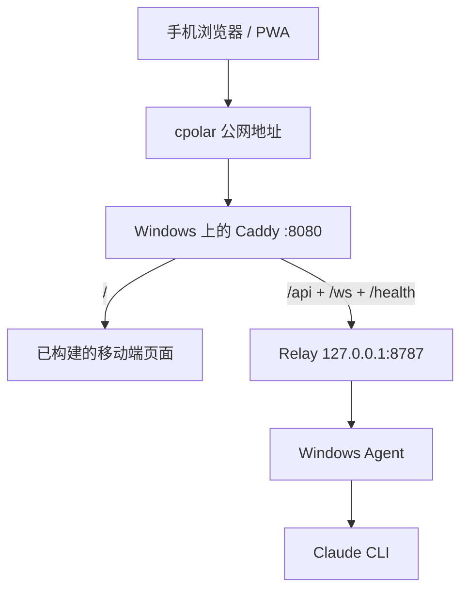

# phone-claude

[English](./README.md) | [简体中文](./README.zh-CN.md)

通过手机从公网控制运行在 Windows 电脑上的 Claude CLI。

这个项目是一套面向个人使用的远程控制组合：

- `mobile`: 手机优先的 PWA
- `relay`: HTTP + WebSocket 中继服务
- `agent`: 运行在 Windows 上、负责托管 Claude CLI PTY 的桌面进程
- `protocol`: 三者共用的消息 schema

当前实现刻意保持很窄：

- 单用户
- 单个活动 Claude 会话
- 仅支持 Windows agent
- 先把输入输出跑通
- 不开放任意 shell 执行

## 架构

```text
手机浏览器 / PWA
  -> 公网地址
  -> Caddy
  -> /api + /ws
  -> Relay
  -> Windows Agent
  -> Claude CLI
```



如果你没有 VPS，当前最简单可用的部署方式是：

```text
手机
  -> cpolar 公网地址
  -> Windows 电脑
    -> Caddy 监听 :8080
    -> Relay 监听 127.0.0.1:8787
    -> Agent 跑在同一台机器
    -> Claude CLI
```

## 目录结构

```text
apps/
  agent/      负责启动和控制 Claude CLI 的 Windows agent
  mobile/     手机上的 PWA
  relay/      认证、配对和 websocket 转发
packages/
  protocol/   共用 zod schema 和消息类型
docs/
  plans/      设计和实现计划
  manual-test-checklist.md
ops/
  agent/      Windows 启动辅助脚本
  caddy/      反向代理配置
  relay/      Linux / Windows 的 relay 环境变量样例
```

## 环境要求

- Node.js 20+
- npm 10+
- Windows 电脑上已安装 Claude CLI，且 `claude` 命令可用
- 建议使用 PowerShell 7
- Windows 上已安装 Caddy
- 如果你没有 VPS，公网访问建议用 cpolar

## 安装

```powershell
cd E:\Java_Learn\phone-claude
npm install
npm run build --workspaces --if-present
```

## 快速开始：Windows + cpolar

这是当前仓库里已经实际验证跑通的方案。

### 1. 启动 relay

先创建 relay 环境文件：

```powershell
cd E:\Java_Learn\phone-claude
Copy-Item .\ops\relay\windows\relay.env.example.ps1 .\ops\relay\windows\relay.env.ps1
notepad .\ops\relay\windows\relay.env.ps1
```

至少要配置这几个值：

- `PHONE_CLAUDE_ADMIN_EMAIL`
- `PHONE_CLAUDE_ADMIN_PASSWORD`
- `PHONE_CLAUDE_JWT_SECRET`
- `PHONE_CLAUDE_REFRESH_SECRET`

加载并启动 relay：

```powershell
cd E:\Java_Learn\phone-claude
. .\ops\relay\windows\relay.env.ps1
npm run start --workspace @phone-claude/relay
```

健康检查：

```powershell
Invoke-RestMethod -Uri http://127.0.0.1:8787/health
```

### 2. 启动 Caddy

当前本机验证通过的配置文件是：

- `ops/caddy/Caddyfile.windows-local`

它会：

- 在 `:8080` 提供 PWA 静态页面
- 把 `/api/*` 代理到 relay
- 把 `/ws` 代理到 relay
- 把 `/health` 代理到 relay

运行：

```powershell
cd E:\Java_Learn\phone-claude
caddy run --config .\ops\caddy\Caddyfile.windows-local
```

检查：

```powershell
Invoke-RestMethod -Uri http://127.0.0.1:8080/health
```

### 3. 用 cpolar 暴露 Caddy

执行：

```powershell
cpolar http 8080
```

使用 cpolar 输出的公网 `https://...` 地址即可。

注意：

- 手机访问使用 cpolar 公网地址
- Windows agent 仍然应该连接本机 `127.0.0.1` relay

### 4. 生成 pairing code

在 Windows 电脑上新开一个 PowerShell 窗口执行：

```powershell
cd E:\Java_Learn\phone-claude

$email = "你的 relay 邮箱"
$password = "你的 relay 密码"

$loginBody = @{
  email = $email
  password = $password
} | ConvertTo-Json

$login = Invoke-RestMethod `
  -Method Post `
  -Uri "http://127.0.0.1:8787/api/login" `
  -ContentType "application/json" `
  -Body $loginBody

$pairBody = @{
  agentName = "Main Windows PC"
} | ConvertTo-Json

$pair = Invoke-RestMethod `
  -Method Post `
  -Uri "http://127.0.0.1:8787/api/pairing-codes" `
  -Headers @{ Authorization = "Bearer $($login.accessToken)" } `
  -ContentType "application/json" `
  -Body $pairBody

$pair.pairingCode
```

### 5. 启动 agent

先创建 agent 环境文件：

```powershell
cd E:\Java_Learn\phone-claude
Copy-Item .\ops\agent\windows\agent.env.example.ps1 .\ops\agent\windows\agent.env.ps1
notepad .\ops\agent\windows\agent.env.ps1
```

这里要填本机 relay，不要填 cpolar 公网地址：

```powershell
$env:PHONE_CLAUDE_RELAY_URL = "http://127.0.0.1:8787"
$env:PHONE_CLAUDE_WS_URL = "ws://127.0.0.1:8787/ws"
$env:PHONE_CLAUDE_AGENT_NAME = "Main Windows PC"
$env:PHONE_CLAUDE_PAIRING_CODE = "替换成 8 位 pairing code"
$env:PHONE_CLAUDE_AGENT_STATE_FILE = ".data/agent.json"
$env:PHONE_CLAUDE_CLAUDE_CMD = "claude"
$env:PHONE_CLAUDE_CLAUDE_ARGS = ""
$env:PHONE_CLAUDE_RECONNECT_BASE_MS = "1000"
$env:PHONE_CLAUDE_RECONNECT_MAX_MS = "10000"
```

启动：

```powershell
cd E:\Java_Learn\phone-claude
. .\ops\agent\windows\agent.env.ps1
npm run start --workspace @phone-claude/agent
```

正常输出应该类似：

```text
phone-claude agent connected as Main Windows PC
```

首次配对成功后，agent 会把长期凭据写到：

- `apps/agent/.data/agent.json`

之后可以把 `PHONE_CLAUDE_PAIRING_CODE` 清空。

### 6. 打开手机页面

在手机上打开 cpolar 公网地址，用 relay 的邮箱和密码登录，刷新 agent 列表，打开 agent，然后开始输入。

## 常用脚本

根目录脚本：

- `npm run build`
- `npm run test`
- `npm run dev:relay`
- `npm run dev:agent`
- `npm run dev:mobile`

各 workspace 常用脚本：

- relay: `npm run start --workspace @phone-claude/relay`
- agent: `npm run start --workspace @phone-claude/agent`
- mobile 构建: `npm run build --workspace @phone-claude/mobile`

## 配置文件

通用环境变量样例：

- `.env.example`

Windows relay 样例：

- `ops/relay/windows/relay.env.example.ps1`

Windows agent 样例：

- `ops/agent/windows/agent.env.example.ps1`

Linux / VPS 样例：

- `ops/caddy/Caddyfile`
- `ops/relay/.env.example`
- `ops/relay/systemd/phone-claude-relay.service`

## 验证

当前仓库里已经跑过的自动化验证：

```powershell
npm run test --workspaces --if-present
npm run build --workspaces --if-present
```

手工检查列表见：

- `docs/manual-test-checklist.md`

## 当前限制

- 单个活动 Claude 会话
- 仅支持 Windows 桌面 agent
- 没有原生移动端 App
- 不支持任意 shell
- PWA 里还没有内建 pairing 页面
- 移动端生产包体积还偏大，后续应拆包
- relay 依赖 Node 实验性的 `node:sqlite`

## 安全说明

- 这个项目目前定位是个人使用
- agent 被限制为运行配置好的 Claude 命令，不是通用 shell
- 如果可以，尽量不要把原始 relay 直接暴露到公网
- 如果使用 cpolar 或类似穿透服务，请保护好 relay 账号和密码
- 如果你分享过日志、截图或配置，请主动轮换 secret

## 后续可做

- 在手机 UI 里加入 pairing 流程
- 把 relay 和 Caddy 也做成 Windows 开机启动
- 优化移动端 bundle 体积
- 优化 agent 在线状态刷新
- 增加会话历史或 transcript 持久化
